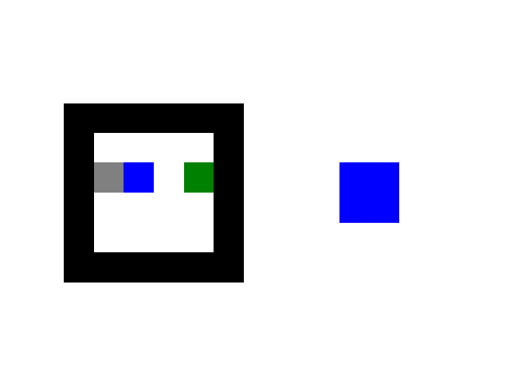
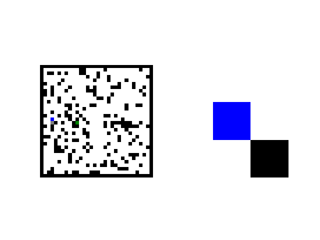
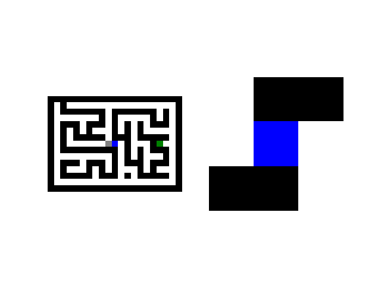
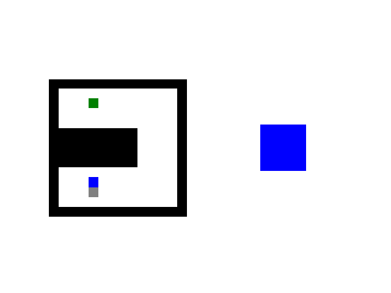
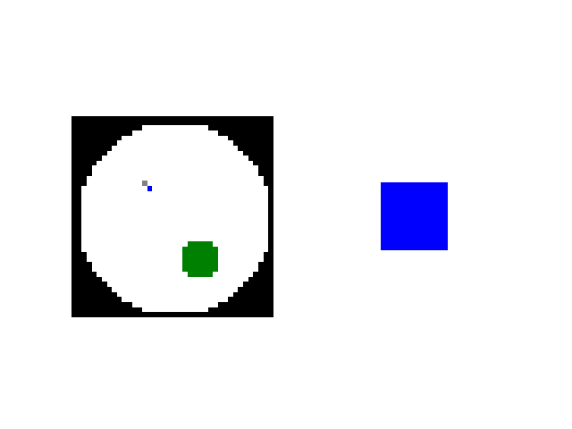

# `gym-maze`: A customizable gym environment for maze/gridworld

This repository contains a customizable gym environment for all kinds of mazes or gridworlds. The motivation of this
repository is, as maze or gridworld are used very often in the reinforcement learning community, however, 
it is still lack of a standardized framework. 

The repo will be actively maintained, any comments, feedbacks or improvements are highly welcomed. 

# Dependencies

This repository requires following packages:
- gym >= 0.10.4
- Python >= 3.6.4
- Numpy >= 1.14.2
- Matplotlib >= 2.1.2
- Scikit-image >= 0.13.1
- (Recommended) JupyterLab >= 0.31.12

# Installation

```bash
cd gym_maze
pip install -e .
```

# How to use by examples

We have provided a [Jupyter Notebook](Maze.ipynb) to illustrate how to make various of maze environments, and generate animation
of the agent's trajectory following the optimal actions solved by A* optimal planner. 

## Simple empty maze

## Random block maze

## Random maze

## U-maze

## Multiple T-maze

## Morris water maze



# How to create your own maze environment

- Maze generator: You can define your own maze generator, simply by creating a class inherited from base class `MazeGenerator` 
and the class should look like at least: 

```
class NewMazeGenerator(MazeGenerator):
    def __init__(self, args...):
        super().__init__()
        
        self.maze = ...
        ...        
    
    def sample_state(self):
        ...     
```

- Maze solver: You can define your own maze solver. For now, please take a look at the code of `Astar_solver.py`.


# TODO
- More extensive documentations
- More different kinds of mazes