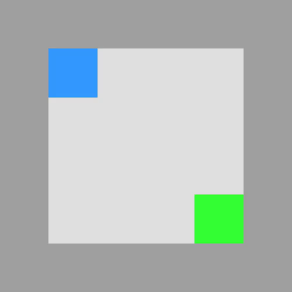
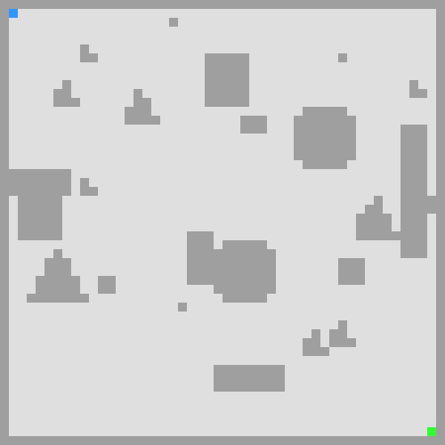
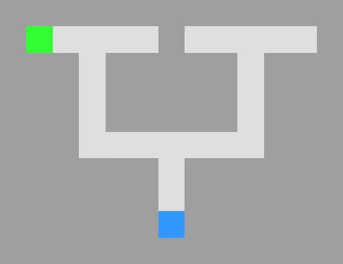
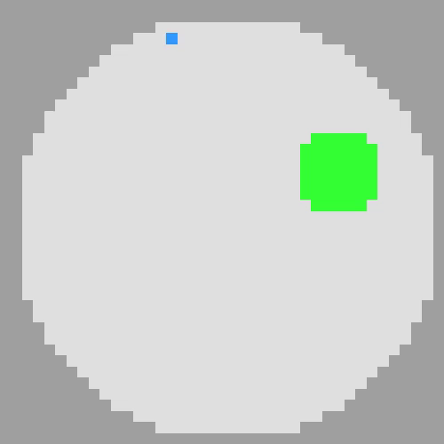

# `mazelab`: A customizable framework to create maze and gridworld environments.

This repository contains a customizable framework to create maze and gridworld environments with gym-like API. It has modular designs and it allows large flexibility for the users to easily define their own environments such as changing rendering colors, adding more objects, define available actions etc. The motivation of this
repository is, as maze or gridworld are used very often in the reinforcement learning community, however, 
it is still lack of a standardized framework. 

The repo will be actively maintained, any comments, feedbacks or improvements are highly welcomed. 

# Installation

## Install dependencies
Run the following command to install [all required dependencies](requirements.txt):

```bash
pip install -r requirements.txt
```

Note that it is highly recommanded to use an Miniconda environment:

```bash
conda create -n mazelab python=3.7
```

## Install mazelab
Run the following commands to install mazelab from source:

```bash
git clone https://github.com/zuoxingdong/mazelab.git
cd mazelab
pip install -e .
```

Installing from source allows to flexibly modify and adapt the code as you pleased, this is very convenient for research purpose which often needs fast prototyping.

# Getting started

Detailed tutorials is coming soon. For now, it is recommended to have a look in [examples/](examples) or the source code.

# Examples

We have provided a [Jupyter Notebook](examples/navigation_env.ipynb) for each example to illustrate how to make various of maze environments, and generate animation
of the agent's trajectory following the optimal actions solved by our build-in Dijkstra optimal planner. 

## Simple empty maze

## Random shape maze

## Random maze

## U-maze

## Double T-maze

## Morris water maze


# How to create your own maze/gridworld environment

- **Define Generator**: You can define your own maze generator, simply generate a two dimensional numpy array consisting of objects labeled by integers.

- **Subclass BaseMaze**: Define your own maze by creating all `Object` and their properties

```python
    class Maze(BaseMaze):
        @property
        def size(self):
            return 10, 10

        def make_objects(self):
            free = Object('free', 0, color.free, False, np.stack(np.where(x == 0), axis=1))
            obstacle = Object('obstacle', 1, color.obstacle, True, np.stack(np.where(x == 1), axis=1))
            agent = Object('agent', 2, color.agent, False, [])
            goal = Object('goal', 3, color.goal, False, [])
            return free, obstacle, agent, goal
```

- **Define Motion**: Define your own motion or simply use the one we provided:  [VonNeumannMotion](mazelab/motion.py), [MooreMotion](mazelab/motion.py)

- **Define gym environment**: Subclass the `BaseEnv` to define the gym environment. 

- **Register environment**: It is recommended to register your own environment to allow easy-to-use `gym.make`

```python
    gym.envs.register(id=some_name, entry_point=your_file_or_class, max_episode_steps=some_steps)
```

- **Build-in Dijkstra solver**: For simple goal-reaching environment, one could use the build-in Dijkstra solver to compute the optimal action sequences given the current agent position and goal position. 

```python
    actions = dijkstra_solver(impassable_array, motions, start, goal)
```

- **Record video of executing optimal actions**: Wrap the environment with gym's `Monitor` to make a video animation. 
    * Practical tip: One can use `imageio` to convert mp4 video to GIF. Refer to the [examples](examples/) for more details. 

# What's new

- 2019-04-05 (v0.2.0)
    - Entirely re-written for much simpler API
    - Subclassing `gym.Env` to allow all related compatibilities

- 2019-01-01 (v0.1.0)
    - Bugfixes

- 2018-11-18 (v0.0.1)
    - Initial release

# Roadmap
- More extensive documentations
- More different kinds of mazes
- More color patterns

# Reference
Please use this bibtex if you want to cite this repository in your publications:
    
    @misc{mazelab,
          author = {Zuo, Xingdong},
          title = {mazelab: A customizable framework to create maze and gridworld environments.},
          year = {2018},
          publisher = {GitHub},
          journal = {GitHub repository},
          howpublished = {\url{https://github.com/zuoxingdong/mazelab}},
        }

